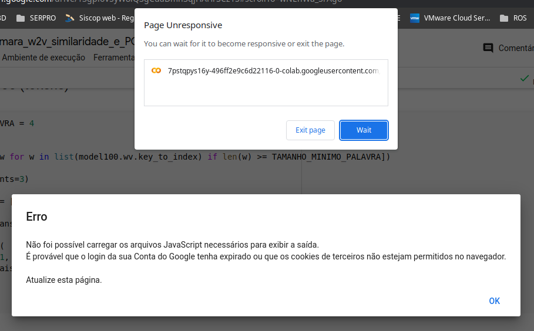
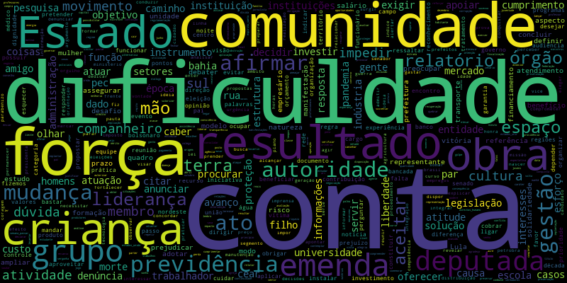
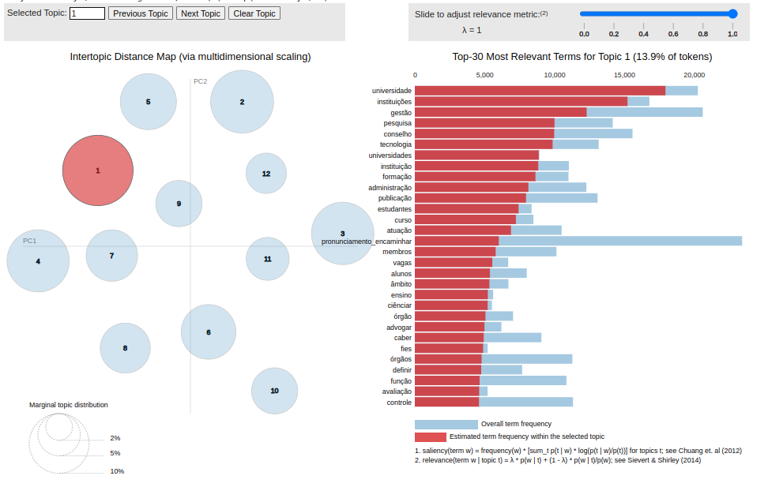
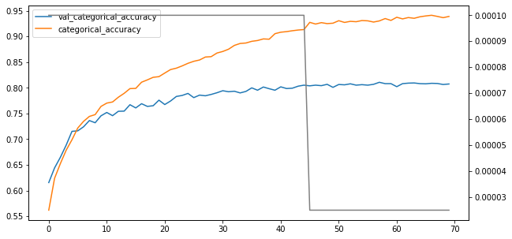
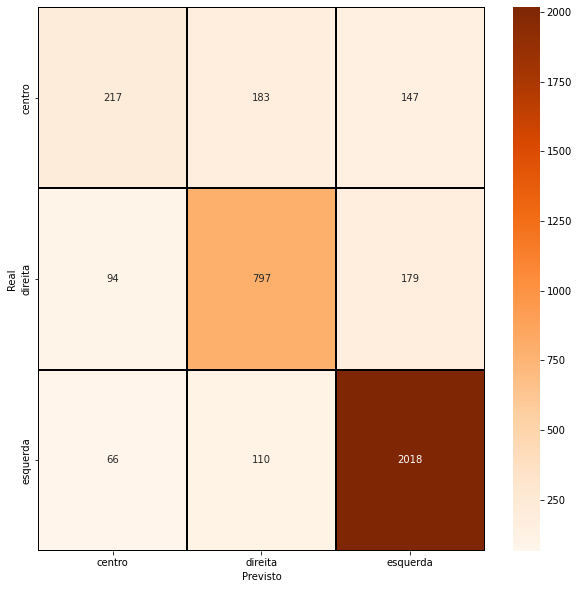
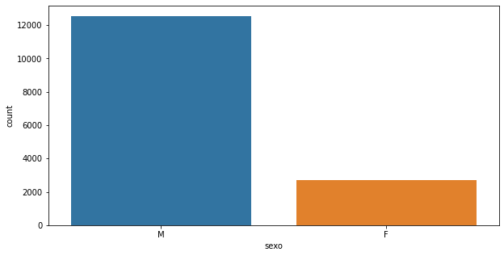
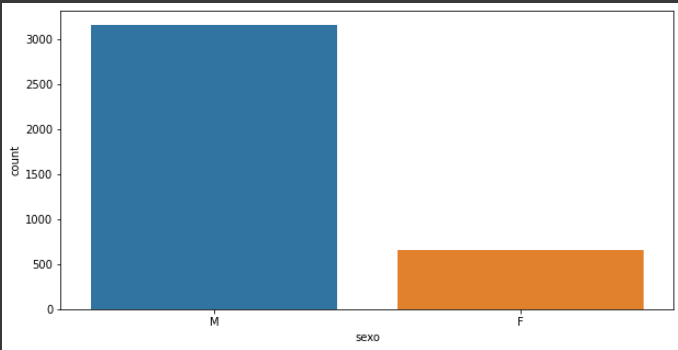
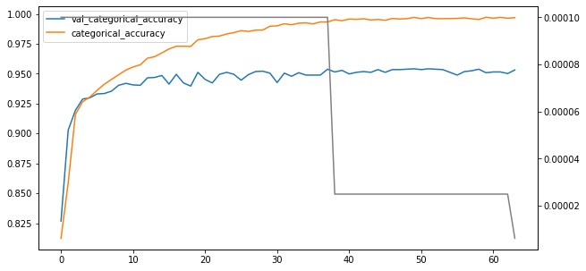
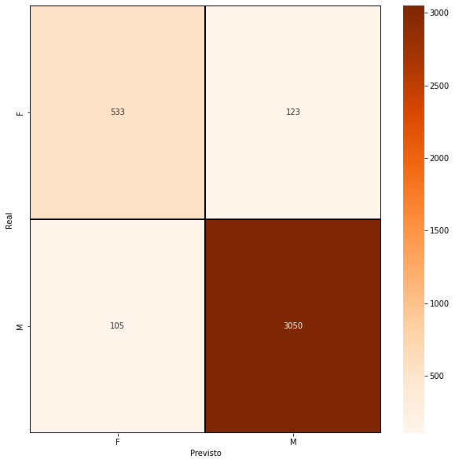

# Análise de discursos de deputados e deputadas federais através de técnicas de NLP e machine learning

#### Aluno: [Rodrigo Montenegro de Oliveira](https://github.com/rmontenegroo)
#### Orientador: [Dr. Leonardo Forero Mendoza](https://www.linkedin.com/in/leonardo-alfredo-forero-mendoza-53803159/)

---

Trabalho apresentado ao curso [BI MASTER](https://ica.puc-rio.ai/bi-master) como pré-requisito para conclusão de curso e obtenção de crédito na disciplina "Projetos de Sistemas Inteligentes de Apoio à Decisão".

- [Código](https://github.com/rmontenegroo/discursos)
  - [Extração e análise](01_nlp_discursos_camara_extracao_e_analise.ipynb)
  - [Geração de embedding](02_nlp_discursos_camara_w2v.ipynb)
  - [Teste do embedding](03_nlp_discursos_camara_w2v_similaridade_e_PCA.ipynb)
  - [Classificação automática de discursos com LDA e Nuvem de palavras](04_nlp_discursos_camara_LDA.ipynb)
  - [Separação e preparo das bases de treino e teste para classificadores](05_nlp_discursos_camara_separacao_discursos.ipynb)
  - [Classficador dos discurssos por espectro político (esquerda, centro e direita)](06_01_nlp_discursos_camara_classficador_por_espectro_esq_cen_dir.ipynb)
  - [Classificador dos discursos por gênero do discursante](06_02_nlp_discursos_camara_classficador_por_genero.ipynb)

- [Dados extraídos e modelos obtidos](https://drive.google.com/drive/folders/1-5KmIeVTRsBUq6oOkMQVGGQxvrMhqdMJ?usp=sharing)
  Para quem quiser utilizar os dados e não estiver disposto a passar por toda as fases de extração, os dados, bem como os modelos gerados estão disponíveis no link acima.

---

### Resumo

Neste projeto discursos de deputados e deputadas federais do congresso brasileiro são analisados empregando-se técnicas de mineração de dados, NLP e machine learning. 

### 1. Introdução

 É quase senso comum que é difícil encontrar coerência entre o discurso e o alinhamento político de muitos dos nossos representantes no congresso e demais poderes. Uma vez que os discursos na câmara federal foram transcritos e disponibilizados, colocamos essa coerência, ou falta dela, a prova, empregando técnicas de mineração de dados, NLP e machine learning.

 Na primeira etapa do projeto [01_nlp_discursos_camara_extracao_e_analise](01_nlp_discursos_camara_extracao_e_analise.ipynb) é feita a extração dos dados: discursos e perfis dos deputados e deputadas do congresso. Em posse desses dados, faz-se uma breve análise sobre as características dos discursantes.

 Em [02_nlp_discursos_camara_w2v](02_nlp_discursos_camara_w2v.ipynb) os discursos obtidos na etapa anterior são processados e são gerados os embeddings Word2Vector que são utilizados em praticamente todas as etapas seguintes.

 Para avaliar a qualidade do embedding gerado na etapa 02, na etapa [03_nlp_discursos_camara_w2v_similaridade_e_PCA](03_nlp_discursos_camara_w2v_similaridade_e_PCA.ipynb) são aplicados o PCA para observar a distribuição dos tokens em relação aos seu pares, e também são realizados alguns testes de similaridade através do cálculo do coseno entre os vetores.

 Na etapa [04_nlp_discursos_camara_LDA.ipynb](04_nlp_discursos_camara_LDA.ipynb) é aplicado o algoritmo de LDA sobre os discursos para se obter uma classificação não supervisionada dos mesmos. Aqui também emprega-se nuvem de palavras para se visualizar os principais tokens presentes nos discursos e identificar eventuais distorções.

 Para as etapas de classificação supervisionada que virão em seguida é necessário separar a base de discursos em treino e teste para que sejam apresentadas aos classificadores. Esse exercício da separação das bases foi realizado aqui em [05_nlp_discursos_camara_separacao_discursos](05_nlp_discursos_camara_separacao_discursos.ipynb).

 Para tentar encontrar alguma relação entre o conteúdo dos discursos e o espectro político do partido do discursante, na etapa [06_01_nlp_discursos_camara_classficador_por_espectro_esq_cen_dir](06_01_nlp_discursos_camara_classficador_por_espectro_esq_cen_dir.ipynb) apresenta-se a uma rede RNN os discursos proferidos na última legislatura.

 E para verificar se seria possível identificar o gênero do discursante apenas pelo discurso, aplica-se o mesmo conjunto da base anterior contra a mesma rede RNN da etapa anterior, aqui em [06_02_nlp_discursos_camara_classficador_por_genero](06_02_nlp_discursos_camara_classficador_por_genero.ipynb).

### 2. Modelagem

#### [Extração e análise](01_nlp_discursos_camara_extracao_e_analise.ipynb)

O primeiro passo é obter a lista das [legislaturas com dados disponíveis no site da câmara](https://dadosabertos.camara.leg.br/arquivos/legislaturas/csv/legislaturas.csv), utilizando a biblioteca Pandas para ler os arquivos CSV. Em seguida obtem-se a [listagem dos parlamentares que já integraram a câmara](https://dadosabertos.camara.leg.br/arquivos/deputados/csv/deputados.csv). De posse da listagem de legislaturas e dos parlamentares, obtem-se as [transcrições dos discursos](https://dadosabertos.camara.leg.br/api/v2/deputados/{idDeputado}/discursos?idLegislatura={idLegislatura}&ordenarPor=dataHoraInicio&ordem=ASC). Da listagem de deputados obtem-se a url que contém as informações detalhadas do parlamentar, tais como, CPF, partido, escolaridade, sexo, etc. 

O espectro político dos partidos não está em nenhuma das fontes mencionadas acima. Através de pesquisa em [pt.wikipedia.org](https://pt.wikipedia.org) e congressoemfoco.uol.com.br(https://congressoemfoco.uol.com.br/area/governo/exclusivo-os-12-partidos-que-formam-a-base-fiel-do-governo-na-camara/) fez-se a associção manual entre partidos e o espectro político predominante. 

Em uma última etapa essas informações são unificadas em um único dataframe Pandas e gravada em arquivo para uso posterior.

#### [Geração de embedding](02_nlp_discursos_camara_w2v.ipynb)

Para uso em fases posteriores, faz-se o embedding em Word2Vector a partir de todos os discursos obtidos na etapa anterior. 

Para cada discurso, foram calculadas as sentenças, os tokens e os lemmas. Em seguida, faz-se uma breve análise dos tokens mais frequentes e então são criados os embeddings de dimensões 50, 100 e 300. Para a criação dos embeddings utiliza-se uma janela de tamanho 10 e uma ocorrência mínima do token de 5.

#### [Separação e preparo das bases de treino e teste para classificadores](05_nlp_discursos_camara_separacao_discursos.ipynb)

A fim de estar sempre utilizando o mesmo dataset nas várias e várias diferentes execuções de modelos com diferentes parâmetros, fez-se necessário a padronização da criação do dataset final a ser usado.

Para buscar discursos com um conjunto de tokens pudessem oferecer um melhor resultado, testou-se várias faixas de tamanho de discurso, finalizando com discursos de tamanho máximo de 1000 tokens e com o mínimo de 250 tokens.

E para facilitar ainda mais a busca de alguma coerência, resolveu-se descartar, a princípio, discursos de partidos considerados de áreas menos deterministícas do espectro: extrema-direita, extrema-esquerda, centro-direita e centro-esquerda. Portanto, no dataset final, só são considerados os espectros: direita, esquerda e centro.

O dataset é então separado em treino e teste pela função train_test_split da bibilioteca Sklearn, de forma estratificada, garantindo a proporção das classes de espectros entre treino e teste.

#### [Classficador dos discurssos por espectro político (esquerda, centro e direita)](06_01_nlp_discursos_camara_classficador_por_espectro_esq_cen_dir.ipynb) e [Classificador dos discursos por gênero do discursante](06_02_nlp_discursos_camara_classficador_por_genero.ipynb)

Em ambos os casos, usou-se uma rede RNN. No futuro é interessante tentar comparar os resultados com redes densas somente, bem como modelos de SVM e Árvores de decisão. A única diferença das redes é o tamanho da camada de saída, de forma que para classificar por espectro são de tamanho 3, e para gênero, 2.

Para os treinamentos das redes o embedding de dimensão 100 foi o escolhido por apresentar resultados um pouco melhores que o de dimensão 50. O de dimensão 300 não foi utilizado pois gerava um altíssimo uso de memória.

Os parêmetros da rede são:

```
BATCH_SIZE = 200
EPOCHS = 250
PATIENCE_LR = 25
PATIENCE_ES = 50
FACTOR = 0.25
MIN_LR = 0.00000001
PLATEAU_MONITOR = 'val_categorical_crossentropy'
LSTM_LAYER1_SIZE = EMBEDDINGS_DIM
LSTM_LAYER2_SIZE = EMBEDDINGS_DIM
LAYER1_DROPOUT_RATE = 0.1
LAYER2_DROPOUT_RATE = 0.25
RECURRENT_DROPOUT_RATE = 0.2
DENSE_LAYER1_SIZE = EMBEDDINGS_DIM
DENSE_LAYER1_DROPOUT_RATE = 0.5
DENSE_LAYER2_SIZE = EMBEDDINGS_DIM
DENSE_LAYER1_FUNCTION = 'tanh'
OUTPUT_LAYER_SIZE = len(ESPECTROS)
OUTPUT_LAYER_FUNCTION = 'softmax'
LEARNING_RATE = 0.0001
OPTIMIZER = tensorflow.keras.optimizers.Adam
LOSS_FUNCTION = 'categorical_crossentropy'
METRIC_FUNCTIONS = ['categorical_accuracy', 'categorical_crossentropy']
VALIDATION_SPLIT_RATE = 0.2

# Modelo
model = Sequential()

# INPUT
model.add(Embedding(MAX_FEATURES+1, output_dim = EMBEDDINGS_DIM, weights = [embeddings_matrix], input_length = MAX_DOC_LEN, trainable = True, mask_zero=True))

# LSTM 1
model.add(Bidirectional(LSTM(LSTM_LAYER1_SIZE, return_sequences = True,  dropout = LAYER1_DROPOUT_RATE)))

# LSTM 2
model.add(Bidirectional(LSTM(LSTM_LAYER2_SIZE, dropout = LAYER2_DROPOUT_RATE, recurrent_dropout = RECURRENT_DROPOUT_RATE)))

# Dense 1
model.add(Dense(units = DENSE_LAYER1_SIZE, activation = DENSE_LAYER1_FUNCTION))
model.add(Dropout(DENSE_LAYER1_DROPOUT_RATE))

# Dense 2
model.add(Dense(DENSE_LAYER2_SIZE))

# Output
model.add(Dense(units = OUTPUT_LAYER_SIZE, activation = OUTPUT_LAYER_FUNCTION))

# Compile
model.compile(optimizer = OPTIMIZER(learning_rate = LEARNING_RATE), loss = LOSS_FUNCTION, metrics = METRIC_FUNCTIONS)
```

### 3. Resultados

#### [Teste do embedding](03_nlp_discursos_camara_w2v_similaridade_e_PCA.ipynb)

Após a criação dos embeddings, faz-se uma análise da qualidade dos mesmos, utilizando-se tanto uma inspeção visual com a distribuição espacial dos tokens com a aplicação de PCA, como alguns exemplos de similaridades pelo cálculo do coseno dos vetores que representam os tokens.

Embedding de dimensão 50:

```
model50.wv.most_similar(['eleição',], topn=10)
[('chapa', 0.7998121976852417),
 ('legenda', 0.7513555288314819),
 ('diplomação', 0.7347360253334045),
 ('campanha', 0.715898871421814),
 ('disputa', 0.7108612060546875),
 ('candidatura', 0.7085728049278259),
 ('reeleição', 0.6936697363853455),
 ('nominata', 0.6905341148376465),
 ('escolha', 0.6899633407592773),
 ('coligação', 0.6817782521247864)]
 ```

Embedding de dimensão 100:

```
model100.wv.most_similar(['eleição',], topn=10)
[('chapa', 0.6608370542526245),
 ('reeleição', 0.6185973882675171),
 ('legenda', 0.5809950828552246),
 ('derrota', 0.5678537487983704),
 ('coligação', 0.5664817690849304),
 ('circunscrição', 0.5375480651855469),
 ('sucessão', 0.5333110690116882),
 ('disputa', 0.5268260836601257),
 ('campanha', 0.5264191627502441),
 ('urna', 0.5213162302970886)]
 ```

 Embedding de dimensão 300:

 ```
 model300.wv.most_similar(['eleição',], topn=10)
 [('chapa', 0.43945544958114624),
 ('campanha', 0.4094240069389343),
 ('legenda', 0.4077368378639221),
 ('agremiação', 0.40758994221687317),
 ('candidatura', 0.3883979916572571),
 ('reeleição', 0.3815804123878479),
 ('sucessão', 0.3806329667568207),
 ('coligação', 0.3779691457748413),
 ('eleições', 0.37733665108680725),
 ('disputa', 0.37556082010269165)]
 ```

 Aqui não foram apresentados os gráficos do PCA pois no instante da confecção deste documento o Google Colab apresentava algum erro para exibição dos mesmos no notebook.

 

#### [Classificação automática de discursos com LDA e Nuvem de palavras](04_nlp_discursos_camara_LDA.ipynb)

##### Nuvem de palavras

Para a nuvem de palavras descartou-se alguns tokens muito comuns no início dos discursos e pronomes de tratamento, como:

```
    'sr', 'sra', 'srs', 'sras', 'a', 'e', 'o', 'as', 'os', 'da', 'de', 'do', \
    'das', 'dos', 'à', 'às', 'um', 'uma', 'uns', 'umas', 'ao', 'aos', \
    'presidente', 'quero', 'obrigado', 'importante', 'importantes', 'momento', \ 'governo', 'nº', 'parabéns', 'parabenizar', 'casa', 'deputado', \
    'deputados', 'agradecer', 'senhor', 'senhora', 'senhores', 'senhoras', \
```

Calculou-se os bigramas e trigramas presentes nos discursos. E então antes de gerar a nuvem de palavras, filtrou-se os tokens em somente substantivos e verbos utilizando-se o PoS tagging da biblioteca Spacy.



Após filtragem de tokens com ocorrência mínima de 3, e não mais frequentes do que em 5% dos discursos:


###### LDA

Após uma busca de hiperparâmetros baseada no valor de coerência (coherence_score = 0.395099), o LDA foi executado com:

```
k = 12 # (quantidade de tópicos);
alpha = 1; e 
beta = 0.5
```

Para visualizar o resultado do LDA, utiliza-se a biblioteca pyLDAvis:




#### [Classficador dos discurssos por espectro político (esquerda, centro e direita)](06_01_nlp_discursos_camara_classficador_por_espectro_esq_cen_dir.ipynb) 

O modelo apresentou uma acurácia de 94.02% na base de treinamento e de 79.56% na de teste. Apesar de não estar explicitado neste trabalho, diversas combinações entre parâmetros foram utilizadas e apesar deste ter sido a melhor acurária para a base de teste, esta métrica oscilou na maior parte das rodadas entre 60 e 78%.

Evolução do treinamento:



Matriz de confusão:




#### [Classificador dos discursos por gênero do discursante](06_02_nlp_discursos_camara_classficador_por_genero.ipynb)

Apesar da base de discursos ter sido estratificada (descuidadamente) somente por espectro, quanto a gênero os datasets de treino e teste mantiveram aparentemente a mesma proporção:

Base de treino:



Base de teste:



Para a base de treino o modelo apresentou uma acurácia de 99% e na base de teste 94%:

Evolução do treinamento:



Matriz de confusão:



### 4. Conclusões

#### LDA

Apesar da quantidade de tópicos ter sido calculada por valores de coerência dos diversos modelos gerados na busca de hiperparâmetros, alguns tópicos são um pouco mais difíceis de entender, apesar do gráfico do LDA mostrar os grupos de tópicos bastante distintos sem zonas de intersecção. Ainda assim, é possível considerar o modelo como um gerador de automático de tags, muito comum em sistemas de indexação de documentos.

#### Classificador de discurso por espectro político

A acurácia do modelo para base de teste ficou em aproximadamente 79% e pela matriz de confusão pode-se dizer que a maior dificuldade está na inferência dos discursos de centro. Considerando a flutuação de interesses políticos deste grupo na câmara de deputados, talvez não seja uma surpresa a dificuldade do modelo encontrar um padrão comum para esta classe. Note que para as classes de direita e esquerda, o modelo apresenta uma performance muito melhor, indicando um posicionamento mais coerente dos parlamentares pertencentes a essas classes em seus discursos.

#### Classificador de discurso por gênero

Com uma acurácia de 90%, o modelo surpreendentemente apresentou facilidade em identificar discursos proferidos por homens e mulheres na câmara federal. Apesar de isso parecer indicar uma grande diferença entre discursos de deputadas e deputados, por outro lado, pode-se deduzir que os discursos das deputadas estão mais alinhados entre si, permitindo que o modelo pudesse encontrar correlação que os caracterizasse com um grupo. Além disso, pode-se também perceber que os discuros das parlamentares femininas não estão contaminados pelo ambiente predominamente masculino. 

---

Matrícula: 202.100.270

Pontifícia Universidade Católica do Rio de Janeiro

Curso de Pós Graduação *Business Intelligence Master*
